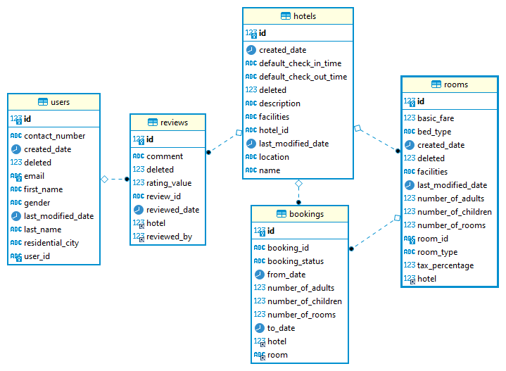

# Booking Service

A booking application with minimal features included

## Requirements

For building the application you need:
- [JDK 1.8](http://www.oracle.com/technetwork/java/javase/downloads/jdk8-downloads-2133151.html)
- [Maven 3](https://maven.apache.org)
- [Docker]()

## Running the application locally

There are several ways to run the application on your local machine.

You are running the application in the port `9701` which can be changed from the `application.yaml` in the `resources` folder with property
    
```
server:
  port: 9701
```

One way is to execute the `main` method inside the `com/github/muhammedshaheer/bookingservice/BookingServiceApplication.java` class from your IDE.
For that you need to setup the MySQL in your local machine with database `booking` with database username as `user` and password as `password`.
Then running the application would run it successfully.

The other way is to run the automated script `run.sh` inside the application.
It is setup with help of docker and docker-compose file.
In the shell script there are 4 commands
1. Running test 
    ```shell 
   mvn clean test
   ```
2. Building the application jar 
    ```
    mvn clean install -DskipTests
    ```
3. Building the docker-image for the application 
   ```
   docker build -t muhammedshaheer/booking-service .
   ```
4. Running the application and the MySQL database server using docker-compose file 
   ```
   docker-compose up -d
   ```
5. This will run the application on the port `9701` successfully
To test whether the application is running successfully, you can type this url in the browser.
   
    [http://localhost:9701/api/test](http://localhost:9701/api/test)
   
## Technologies used
- Spring Boot
- Java 8
- MySQL Database
- Dependencies used
    - Spring Boot Starter Web (For REST API)
    - Spring Boot Starter Data JPA (For JPA connectivity)
    - Spring Boot Starter Validation (For Request Body Validations)
    - MySQL connector Driver (For MySQL connectivity driver)
    - Lombok (To avoid boiler plate codes for constructor, getters and setters)
    - Junit Jupiter (For unit testing the application)
    
## API Samples

The API Request URIs and sample request bodies are recorded in below document.

[API Documentation](https://docs.google.com/document/d/162Bj4cobQJamH9rllH6juy4V8xgwUA0bQq67bu73fGA/edit?usp=sharing)

## Database Scripts

The source contains file named `database-script.sql` which contains both DDL and DML scripts. As of DDL scripts will be automatically created by starting the spring boot application.

Below is the ER Diagram of the `booking` database

